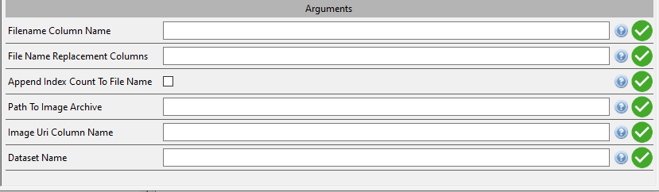

# DRS Image Extraction Cheatsheet
Originally the DRS Image extraction pipeline plugin was very closely coupled to a specific dataset. Efforts have been made over time to decouple this plugin from that original dataset.
As such, configuring this plugin can be a bit fiddly.

## Things you'll need
Any extracion that uses the DRS Image Extraction pipleine will need the following columns within your extraction:
* The image filename column - stores the name of the image files ('Filename Column Name' Configuration option)
* The location of the file - stores the path string to find the image in the file system ('Image Uri Column Name' Configuration option)

## Configuring the Pipeline
The configuration options should look like

* Filename Column Name should be populated with the name of the column that contains the image filename
* File Name Replacemnt Columns should be populated with a comma separated list of column names that you wish to use to deidentify the filename - historically this has been 'Examination_Date,Image_Num' but it will depend of your available data
* Append Index Count To File Name adds a number to the end of each filename if selected. This prevents duplicate file names. It is strongly reccomended you enable this unless your replacement columns configuration contains some UUID.
* Path to image archive should be populated with the path to the image archive file
* Image URI Column name should be populated with the name of the column that contains the path the the image for this entry. This field is required and does require your data to host the filename and location path in seperate columns.
* Dataset Name should be populated with a regex string to match on all datasets bundles that reference images, '.*' will match on everything